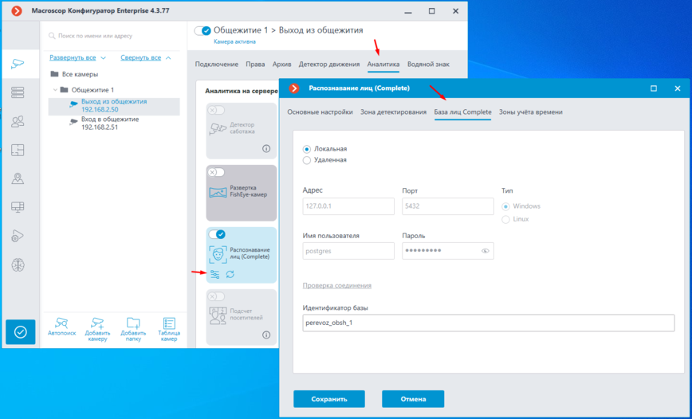
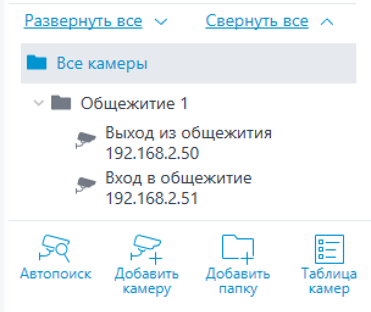
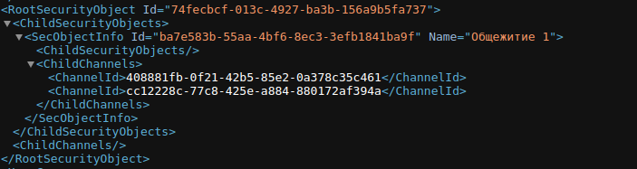

# HttpRabbitSync Documentation

## Описание

**HttpRabbitSync** - это приложение, предназначенное для получения событий "Обнаружено лицо (Модуль распознавания лиц)" от системы видеонаблюдения Macroscop. Оно добавляет событие в очередь и поочередно обрабатывает его, отправляя запрос на обновление статуса студента в общежитии (да/нет в зависимости от того, вышел он или зашел).


## Установка и настройка

Настройте файл ``./development/app.config.json``

### 1. Настройка подключения к серверу Macroscop

Откройте файл `app.config.json` и замените строку подключения к серверу Macroscop на следующую:

```
http://{address}:{port}/event?login={login}&password={password}&filter={filter}&responsetype=json
```

#### Получение параметра {filter}

Чтобы узнать параметр {filter}, выполните следующие шаги:

1. Перейдите по следующему URL:

   ```
   http://{address}:{port}/command?type=getallregisteredevents&login={login}&password={password}
   ```

2. Скопируйте `id` у необходимого события. В нашем случае это событие "Обнаружено лицо (Модуль распознавания лиц)".

Понял, давайте сделаем это правильно. Вот отдельный пункт, который вы просили:

### 2. Настройка камер для распознавания студентов по общежитиям

Для обеспечения того, чтобы каждая камера распознавала только студентов своего общежития, необходимо добавить идентификатор базы лиц (DbId).

#### Выполните следующий PUT-запрос, чтобы настроить камеру с указанием нужного DbId:

   ```http
   PUT http://{address}:{port}/configure/channels/{ChannelId}/facescomplete
   Content-Type: application/json
   
   {
       "ChannelSettings": {
           "DbId": "perevoz_obsh_1"
       }
   }
   ```

Если все сделано правильно должно отобразиться поле для ввода идентификатора БД:



### 3. Настройка информации о филиалах и общежитиях

В файле `app.config.json` необходимо заполнить информацию о филиалах и общежитиях. Пример структуры:

```json
"Branches": [
    {
        "id": "",
        "name": "Перевоз",
        "Dormitories": [
            {
                "id": "",
                "name": "Общежитие 1",
                "Cameras": [
                    {
                        "type": "EntranceCamera",
                        "id": ""
                    },
                    {
                        "type": "ExitCamera",
                        "id": ""
                    }
                ]
            }
        ]
    }
]
```

#### Получение информации о всех общежитиях

Для получения информации о всех общежитиях, вы можете использовать следующий API:

```
https://system.fgoupsk.ru/student/dormitories/api/v1/info
```

Укажите `id` филиала, по желанию добавьте `name` филиала, а также `id` общежития и `id` камер. Для получения информации о камерах воспользуйтесь следующим URL:

```
http://{address}:{port}/configex?login={login}&password=
```

### 4. Удобство работы с камерами

Для удобства работы с камерами, вы можете добавить их в папку с содержательным названием в **Macroscop Configurator**.



### 5. Запуск
После настройки приложения, запустите его с помощью Docker. Для этого выполните следующую команду:
```console
docker compose up -d
```
---

Следуйте этим шагам, чтобы правильно настроить приложение HttpRabbitSync для взаимодействия с системой Macroscop.
